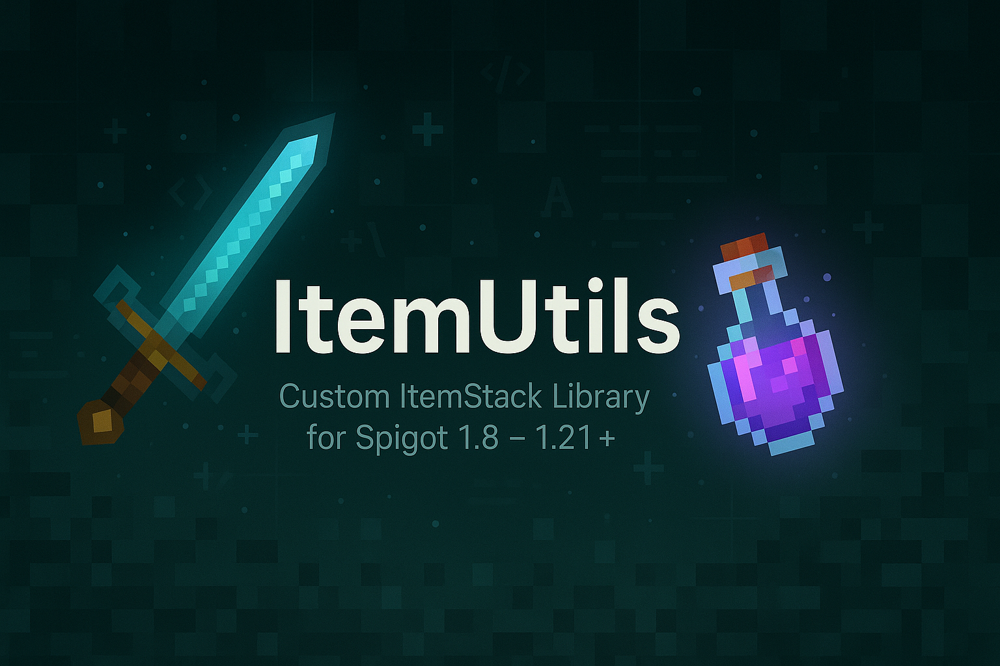

# ItemUtils

[](https://jitpack.io/#Rednaxela000/ItemUtils)
[](https://github.com/Rednaxela000/ItemUtils/actions/workflows/ci.yml)

> A lightweight Java library for easy creation and manipulation of Minecraft `ItemStack`s across Spigot 1.8–1.21.5+.

---

## Features

- Create and modify `ItemStack`s with fluent builders
- Support for both legacy and modern item IDs
- Automatic NBT handling and version compatibility
- No other plugin required—just add as a dependency

---

## Installation

Add the repository and dependency to your `pom.xml`:

```xml
<repositories>
  <repository>
    <id>jitpack.io</id>
    <url>https://jitpack.io</url>
  </repository>
</repositories>

<dependencies>
  <dependency>
    <groupId>com.github.rednaxela000</groupId>
    <artifactId>itemutils</artifactId>
    <version>v0.0.1</version>
  </dependency>
</dependencies>
```

## Usage

TODO

## License

This project is currently released under the MIT License.
See [LICENSE](LICENSE) for full text.